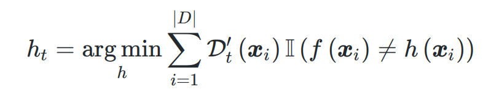
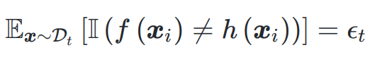

# 从零实现一个简单的AdaBoost算法

## 1.算法原理
AdaBoost是集成学习的一种方式，根据西瓜书的推导发现，在每一轮的迭代中，最核心的两大步骤为：
- 根据更新之后的样本分布训练基学习器，样本分布是偏向于上一轮错误分类的样本；
- 计算该轮基学习器的权重alpha，并更新样本分布
具体的推导根据下面的截图所示：

总体流程为：

## 2.代码实现
数据集：西瓜3.0α
python运行环境:python3.7,pandas,numpy,matplotlib

具体细节参照AdaBoost.py,里面函数的功能如下：
- load_dataset():导入训练数据集
- SingleTree(): 生成单层决策树模型
- TrainModel(): 训练单层决策树模型
- TrainAdaboost():调用前面3个函数，训练集成学习模型
- visualization():可视化训练结果

## 3.实验结果
实验初始默认设置40个基学习器，但结果显示7个基学习器就已经在训练集上误差为0，每个基学习器的切分节点可视化为：

## 4.一些思考
- 训练没有考虑防止过拟合，后期可以在更大的数据集上做尝试。
- 西瓜书上的AdaBoost推导只适用于二分类的问题，且标签为{-1,1}，损失函数为exp(-f(x)*h(x))，后期考虑将AdaBoost一般化。